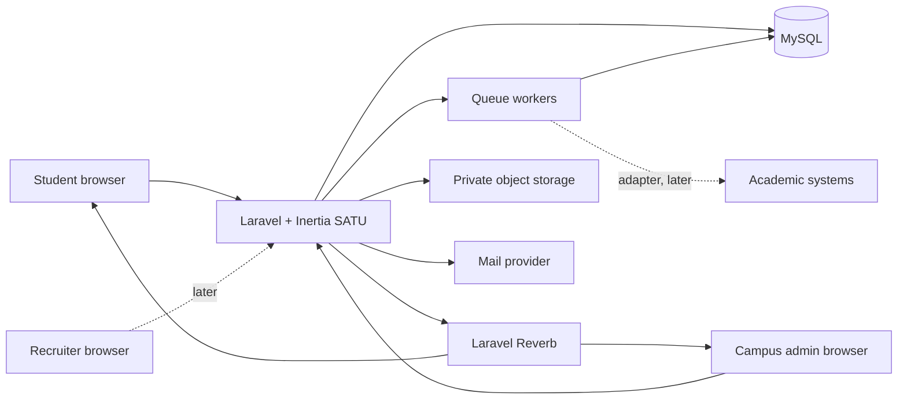
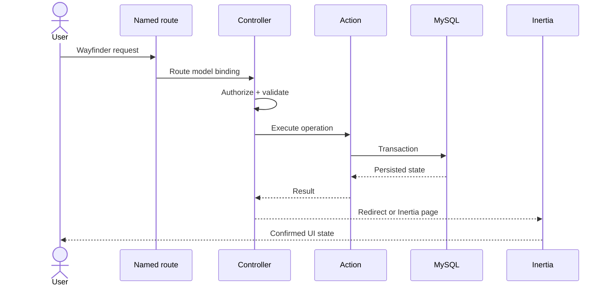

# Technical Architecture SATU

## 1. Status

Dokumen ini mendeskripsikan target architecture. Codebase saat ini masih Laravel React starter: authentication dasar, settings, dan placeholder dashboard. Domain SATU, MySQL production, dan Laravel Reverb belum diimplementasikan.

## 2. Architecture Goals

- Menyelesaikan core loop student dan campus dalam modular monolith.
- Menjaga institution boundary pada HTTP, queue, broadcast, storage, dan reporting.
- Menjadikan matching explainable serta versioned.
- Menjadikan database source of truth dan realtime sebagai delivery mechanism.
- Memisahkan portfolio publik dari restricted inclusion data.
- Menyediakan adapter boundary untuk integrasi tanpa mengunci vendor.
- Mengikuti struktur Laravel yang ada dan menghindari abstraction prematur.

## 3. System Context



## 4. Runtime Containers

| Container            | Responsibility                                                       |
| -------------------- | -------------------------------------------------------------------- |
| Laravel web          | Session auth, authorization, validation, commands, Inertia responses |
| Inertia React client | Page rendering, forms, local interaction, realtime event merge       |
| MySQL                | Canonical transactional state                                        |
| Queue worker         | Matching calculation, notifications, exports, sync, heavy analytics  |
| Laravel Reverb       | Private/presence WebSocket delivery                                  |
| Private storage      | Evidence, exports, and protected files                               |
| Scheduler            | Expiry, recomputation, retention, and reconciliation                 |

Production dapat menjalankan container terpisah untuk web, queue, scheduler, dan Reverb. Local development boleh menjalankannya melalui `composer run dev` setelah dependencies tersedia.

## 5. Modular Monolith Boundaries

Gunakan struktur Laravel yang ada: controllers, requests, actions, models, policies, jobs, events, notifications, dan enums. Jangan membuat framework internal atau base directory baru tanpa kebutuhan konkret.

| Module              | Owns                                                         |
| ------------------- | ------------------------------------------------------------ |
| Identity & Tenancy  | Institution, membership, role, verification                  |
| Profiles & Skills   | Student profile, taxonomy, availability, visibility          |
| Projects & Teams    | Project lifecycle, role needs, invitations, membership       |
| Workspace           | Task, discussion, attachment, presence-facing events         |
| Contributions       | Submission, evidence, versions, validation                   |
| Matching            | Score versions, runs, recommendations, feedback              |
| Inclusion           | Restricted signals, review outcomes, audit context           |
| Portfolio           | Portfolio entry dan audience visibility                      |
| Campus Operations   | Review queues, report queries, integration commands          |
| Talent Portal       | Recruiter organization, entitlement, search, contact request |
| Platform Operations | Institution provisioning, abuse, system-level audit          |

Cross-module write memakai explicit Action class atau domain operation. Read composition untuk dashboard boleh menggabungkan query, tetapi tidak mengambil ownership entity lain.

## 6. Request dan Page Flow



### Rules

- Frontend tidak menggunakan hardcoded backend URL.
- Named imports Wayfinder menjadi default.
- Form memakai Inertia `<Form>` atau existing project convention.
- Standalone HTTP hanya untuk interaction yang tidak membutuhkan page visit dan tetap memakai typed route.
- Deferred props selalu memiliki skeleton/empty treatment.
- Query parameter search/filter dipertahankan di URL.

## 7. Identity dan Tenant Context

### Authentication

- Fortify session authentication dengan email/password.
- Email verification wajib untuk collaboration features.
- Registration hanya membuat user biasa; role sensitif tidak berasal dari request.
- SSO menjadi adapter fase lanjut.
- Login dan recovery tetap rate-limited.

### Tenant model

- `institution_memberships` menghubungkan user dengan institution dan role.
- Active request memilih institution context dari route/object dan authorized membership, bukan header bebas.
- Tenant-owned object membawa `institution_id`.
- Policy memverifikasi role, membership status, object relation, dan institution match.
- Queue payload dan broadcast event membawa identifier tenant yang cukup untuk authorization/reload, bukan sensitive snapshot.

Tidak memakai database-per-tenant. Tidak mengandalkan hidden navigation sebagai authorization.

## 8. Realtime Architecture

Laravel Reverb dipasang melalui workflow broadcasting Laravel saat workspace mulai diimplementasikan.

### Channel contracts

| Channel                                   | Type     | Authorized audience     |
| ----------------------------------------- | -------- | ----------------------- |
| `projects.{projectId}`                    | Presence | Active project members  |
| `users.{userId}`                          | Private  | User yang sama          |
| `institutions.{institutionId}.operations` | Private  | Authorized campus admin |

Channel authorization harus memeriksa institution dan membership. Existence object tidak boleh bocor melalui error response.

### Event contracts

| Event                   | Minimum payload                                              |
| ----------------------- | ------------------------------------------------------------ |
| `TaskUpdated`           | task id, project id, version, changed fields, actor summary  |
| `MessageCreated`        | message id, project id, author summary, safe content payload |
| `ContributionSubmitted` | contribution id, project id, status, version                 |
| `ContributionValidated` | contribution id, status, version, reviewer-safe summary      |
| `MemberPresenceChanged` | user-safe presence identity                                  |

Payload tidak memuat inclusion signal, private audit reason, secret, signed storage credential, atau data tenant lain.

### Delivery rules

1. Authorize dan validate command.
2. Commit database transaction.
3. Dispatch queued broadcast after commit.
4. Client merge berdasarkan object id dan version.
5. Reconnect memicu partial reload/reconciliation.

Broadcast failure tidak membatalkan transaction utama. Client yang tidak terhubung tetap memperoleh state benar pada refresh.

## 9. Matching Architecture

Matching adalah deterministic, versioned scoring service.

```text
match_score =
    weight_skill_fit * skill_fit
  + weight_project_need * project_need
  + weight_availability * availability
  + weight_connectivity_opportunity * connectivity_opportunity
```

Formula di atas adalah shape, bukan bobot final.

### Contract

- Input snapshot dapat direproduksi atau ditelusuri.
- Output menyimpan score version, component scores, dan explanation keys.
- UI hanya menerima alasan yang aman dan relevan.
- Feedback “not relevant” tidak langsung mengubah model production tanpa review.
- Recalculation dijalankan melalui queue dan idempotent run.
- Tidak ada sentiment analysis chat atau mental-health classification.

Future ML harus hidup di belakang contract yang sama dan tidak boleh menghapus explainability, audit, evaluation, atau rollback.

## 10. Data dan Storage

- Production database: MySQL.
- Local/test SQLite boleh digunakan hanya bila migration dan behavior tetap kompatibel.
- Evidence menggunakan private disk; download melalui short-lived authorized response.
- Public portfolio memakai derivative atau explicitly published asset, bukan membuka file private.
- File validation memeriksa size, extension, MIME, dan ownership.
- Large export dibuat oleh queue dan memiliki expiring download.

## 11. Queue dan Scheduler

### Queue jobs

- Recompute recommendation.
- Generate inclusion candidate signal setelah governance gate.
- Send notification.
- Generate data export.
- Sync verified credit melalui integration adapter.
- Process/scan evidence bila layanan tersedia.

Setiap job mendefinisikan timeout, retry, idempotency, failure reporting, dan tenant context. External integration memakai contract dan fake pada test.

### Scheduled work

- Expire invitation dan contact request.
- Reconcile stuck integration.
- Refresh recommendation yang stale.
- Apply retention policy.
- Prune expired exports.

Scheduler memakai overlap protection untuk task yang tidak boleh berjalan bersamaan.

## 12. Integration Boundaries

### Academic integration

`AcademicActivityGateway` adalah conceptual contract:

- Submit verified activity dengan idempotency key.
- Query status bila provider mendukung.
- Map external reference.
- Return typed success/retryable/permanent failure.

Endpoint dan credential tidak ditentukan sampai institution pilot dipilih.

### Recruiter billing

Billing provider berada di belakang entitlement contract. Search authorization bergantung pada entitlement internal, bukan callback provider pada setiap request.

## 13. Observability

- Structured log memuat request/correlation id, institution id, actor id, dan operation; sensitive content dikecualikan.
- Audit log adalah domain record terpisah dari application log.
- Metrics minimum: request latency/error, queue age/failure, Reverb connections/messages, database slow query, storage failure, matching run duration.
- Alert untuk cross-tenant authorization anomaly, queue backlog, broadcast failure spike, dan integration failure.
- Reverb membutuhkan process supervision, allowed origins, TLS termination, dan restart strategy.

## 14. Deployment Stages

| Stage      | Required services                                                        |
| ---------- | ------------------------------------------------------------------------ |
| Local      | PHP, SQLite/MySQL, Vite; Reverb/queue saat feature terkait               |
| CI         | MySQL-compatible test path, queue/broadcast fakes, browser environment   |
| Demo       | MySQL, queue worker, Reverb, private storage, synthetic data             |
| Pilot      | Managed backups, monitoring, incident process, DPIA gates, retention     |
| Production | Horizontal readiness, Redis as required, Reverb scaling, recovery drills |

Provider deployment tetap terbuka. Arsitektur tidak boleh mengklaim high availability sebelum diuji.

## 15. Architecture Acceptance

- Tidak ada tenant-owned query tanpa scope dan policy.
- Database refresh memulihkan state walaupun realtime gagal.
- Match output dapat dijelaskan dan ditelusuri ke version.
- Recruiter projection tidak memuat restricted fields.
- Sensitive file tidak dapat diakses dengan path tebakan.
- Queue dan integration command idempotent.
- Critical operations memiliki audit entry.
