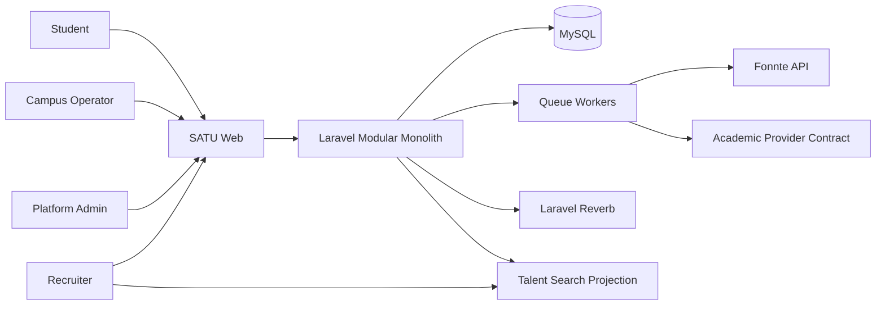

# Technical Architecture SATU

## 1. Status

Target architecture adalah Laravel 13 modular monolith, Inertia v3 React, MySQL, queue workers, Laravel Reverb, dan provider adapters. Runtime saat ini masih parsial. Issue implementasi wajib memeriksa code sebelum menyatakan komponen tersedia.

## 2. System Context

Database adalah source of truth. Reverb hanya mengirim authorized deltas setelah commit. Provider response tidak boleh langsung menjadi domain truth tanpa validation dan persistence.

## 3. Modular Boundaries

Gunakan framework directories yang ada. Business capability dipisahkan melalui model, Action, Policy, Form Request, query/projection class, Job, Event, dan Notification yang eksplisit:

- Identity dan Phone Verification
- Institution dan Roster
- Profile dan Skills
- Projects, Matching, dan Teams
- Workspace
- Contributions dan Portfolio
- Gamification
- Campus Operations dan Inclusion
- Talent
- Academic Integration
- Notification dan Audit

Jangan membuat base architecture folder baru tanpa approval.

## 4. Request dan Page Flow

- Laravel named route menerima request.
- Form Request menangani validation dan request-level authorization.
- Policy melindungi setiap resource serta tenant boundary.
- Action menjalankan business transition dalam transaction.
- Event domain dipublikasikan after commit.
- Inertia mengirim initial page state dan command result.
- React memakai Wayfinder, bukan hardcoded backend URL.

## 5. Identity dan Authorization

Laravel Fortify tetap menjadi frontend-agnostic auth backend, tetapi username field dikustomisasi menjadi private `username`. Registrasi dan recovery adalah application-owned flow berbasis verified phone dan OTP. Fortify email verification/reset flow dinonaktifkan setelah rebaseline selesai.

Phone dinormalisasi ke E.164 memakai `propaganistas/laravel-phone`. SATU menghasilkan OTP, menyimpan hash, expiry, attempt count, consumed state, purpose, serta audit-safe metadata. Fonnte hanya mengirim pesan.

Authorization memakai native Laravel Policies dan Gates. `spatie/laravel-permission` tidak menjadi baseline karena role SATU berasal dari institution/recruiter membership dan active tenant context, bukan global user role. Keputusan ini dapat ditinjau ulang hanya jika permission matrix berkembang di luar relationship-based Policy tanpa mengorbankan tenant isolation.

## 6. Tenant Context

Active institution ditentukan server-side dari verified membership. Institution scope wajib diterapkan pada query, route binding, Policy, job payload, cache key, storage path, export, notification, broadcast channel, dan observability context. Platform operation harus eksplisit, diaudit, dan tidak menggunakan hidden bypass.

## 7. Realtime

- Private channel untuk resource-scoped delta.
- Presence channel hanya untuk active team member yang berwenang.
- Event payload memakai allowlist, version, resource ID, occurred-at, dan actor display projection bila perlu.
- Client menerima delta, tetapi reconciliation selalu membaca snapshot database.
- Duplicate, out-of-order, reconnect, permission loss, dan stale state diuji.

## 8. Matching dan Inclusion

Matching service menerima normalized input, versioned weights, dan menghasilkan component scores serta explanation untuk empat dimensi yang disetujui.

Inclusion engine membaca collaboration graph projection, bukan message content. Engine dan UI berada di balik Laravel Pennant. Synthetic dan real activation dipisahkan. Signal diserialisasi hanya melalui restricted projection dan selalu menuju human review.

## 9. Gamification

XP ledger append-only memakai unique source key untuk idempotency. Badge evaluator membaca approved versioned rules. Leaderboard projection dibangun per institution dan semester, menyimpan denominator, active-member rule version, cohort suppression, tie method, serta computed-at. Inclusion tidak masuk pipeline.

## 10. Talent Search

Talent memakai recruiter-safe projection terpisah dari domain model dan private portfolio. Laravel Scout database engine menjadi baseline search tanpa external infrastructure. Organization membership, verification, entitlement, candidate visibility, saved item, serta contact request tetap transactionally authorized.

## 11. Integrations dan Notifications

`WhatsAppGateway` memiliki Fonnte implementation dan fake. Outbox/job menangani delivery, retry, provider message ID, callback, reconciliation, masking, serta idempotency. Gunakan Laravel HTTP Client, Notifications, Queue, dan scheduler. Jangan memakai unofficial Fonnte package.

`AcademicGateway` memiliki sandbox implementation dan provider implementation di masa depan. Sync job membawa internal idempotency key, mapping version, external reference, status history, retry class, serta reconciliation metadata.

## 12. Libraries

- Existing: Laravel Fortify, Inertia, Wayfinder, Reverb/Echo, Pest, Tailwind.
- Approved fit-first: Laravel Pennant, Laravel Scout database engine, `propaganistas/laravel-phone`, `spatie/simple-excel`, `@tanstack/react-table`, Recharts, Cytoscape.js, `@dnd-kit/react`, dan `@axe-core/playwright`.
- Setiap issue menyebut install command, compatibility, license review, alasan, dan fake/test strategy. Dependency baru tetap memerlukan approval sebagaimana project rule.

## 13. Operations

Queue harus memiliki retry class, timeout, backoff, idempotency, dead-letter handling, dan dashboard/runbook. Log memakai request/tenant/job correlation tanpa phone, OTP, token, message body, private evidence, atau inclusion detail. Backup, restore, provider degradation, and incident response diuji sebelum production gate.
