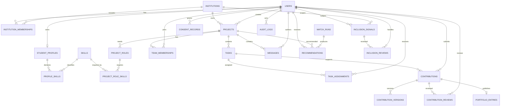

# Data Model SATU

## 1. Principles

- MySQL adalah production source of truth.
- Semua tenant-owned records membawa `institution_id` secara langsung atau melalui parent yang tidak ambigu.
- Foreign key, unique constraint, dan index menegakkan invariant yang dapat ditegakkan database.
- Enum domain memiliki canonical identifier; UI label diterjemahkan.
- Sensitive derivation dipisahkan dari recruiter-visible projection.
- History keputusan tidak ditimpa.
- Migration dibuat dengan Artisan dan tidak menggabungkan schema dengan seed data.

## 2. Conceptual ERD

Recruiter entities ditambahkan pada fase Talent Portal dan tidak mengubah ownership portfolio.

## 3. Identity dan Tenancy

### `users`

Core Fortify identity: name, email, verification, password, security fields. User tidak menyimpan satu global role.

Indexes:

- Unique normalized email.
- Email verification query bila diperlukan.

### `institutions`

Core fields:

- `id`, `name`, `slug`, `status`, timezone, locale.
- Settings non-secret yang benar-benar institution-owned.

Constraints:

- Unique `slug`.
- Status canonical: `pending`, `active`, `suspended`, `archived`.

### `institution_domains`

- Institution, normalized domain, verification status, verified timestamp.
- Unique active domain lintas institution kecuali policy secara eksplisit mengizinkan shared domain.

### `institution_memberships`

- User, institution, role, status, institutional identifier, verification method, verified by/at.
- Role: `student`, `campus_admin`.
- Status: `unverified`, `pending`, `verified`, `suspended`.

Indexes/constraints:

- Unique user + institution + role bila multi-role tidak dibutuhkan.
- Institution + status untuk admin queue.
- User + status untuk context selection.

## 4. Profile dan Skills

### `student_profiles`

- User, primary institution context, program, cohort, bio, availability, recruiter discoverability.
- Public/recruiter visibility tidak disimpulkan dari nullable field; gunakan explicit setting.

### `skills`

- Canonical name, slug, category, status.
- Global taxonomy atau institution extension harus diputuskan sebelum implementation detail.

### `profile_skills`

- Profile, skill, proficiency, evidence note, verification level.
- Unique profile + skill.

Skill verification tidak boleh memakai badge yang sama dengan institution-verified contribution.

## 5. Projects dan Teams

### `projects`

- Institution, owner user, type, title, summary, outcome, deadline, capacity, status, visibility.
- Status: `draft`, `open`, `forming`, `active`, `completed`, `cancelled`, `archived`.

Indexes:

- Institution + status + deadline.
- Owner + status.
- Search index diputuskan berdasarkan MySQL version dan query nyata.

### `project_roles`

- Project, title, description, capacity, status.

### `project_role_skills`

- Project role, skill, required proficiency, importance.

### `team_memberships`

- Project, user, project role, status, joined/left timestamps.
- Status: `invited`, `requested`, `active`, `left`, `removed`, `completed`.

Constraints:

- Unique active relationship per user/project.
- Capacity tetap membutuhkan transaction/lock; unique constraint saja tidak cukup.

## 6. Workspace

### `tasks`

- Project, creator, title, description, status, priority, due date, sort position, version.
- Index project + status + due date.
- Version mendukung optimistic/concurrent merge.

### `task_assignments`

- Task dan user.
- Unique task + user.

### `messages`

- Project, author, optional task context, body, edited/deleted timestamps.
- Isi message tidak dipakai untuk sentiment atau mental-health inference.
- Index project + created time.

### `attachments`

- Institution, uploader, attachable type/id, private disk/path, original name, MIME, size, checksum, status.
- Storage path bukan public URL.

## 7. Contributions dan Portfolio

### `contributions`

- Institution, project, task, student, current status, current version, submitted/decided timestamps.
- Status: `draft`, `pending`, `revision_requested`, `approved`, `rejected`, `archived`.

### `contribution_versions`

- Contribution, version number, description, declaration, submitted timestamp.
- Immutable setelah submit.
- Unique contribution + version.

### `contribution_evidence`

- Version dan attachment.
- Menyimpan evidence ordering/description bila dibutuhkan.

### `contribution_reviews`

- Contribution/version, reviewer, decision, reason, policy version, created timestamp.
- Append-only.

### `portfolio_entries`

- Student, contribution, title/summary override, visibility, published timestamp.
- Verification level berasal dari contribution provenance, bukan request user.
- Visibility: `private`, `institution`, `recruiter`, `public`.

## 8. Matching

### `match_score_versions`

- Version key, weight/config snapshot, activation timestamp, status, author/approval.

### `match_runs`

- Institution, subject user, score version, input snapshot reference/hash, started/completed status.

### `recommendations`

- Run, student, project/role, total score, component scores, explanation keys, rank, status, expiry.
- Component score disimpan dalam typed columns atau validated JSON; keputusan final mengikuti query/evaluation needs.
- Status: `active`, `acted`, `hidden`, `expired`, `invalidated`.

### `recommendation_feedback`

- Recommendation, student, reason, optional note.
- Tidak langsung mengubah weight production.

## 9. Inclusion

### `collaboration_events`

- Institution, actor, project, event type, occurred time, minimal relationship metadata.
- Bukan salinan message body.
- Digunakan hanya untuk purpose yang didokumentasikan.

### `inclusion_signal_versions`

- Calculation version, minimum sample, thresholds, status, approval.

### `inclusion_signals`

- Institution, student, version, factors, data window, status, expiry.
- Restricted model/query boundary.
- Tidak pernah direlasikan ke recruiter organization.

### `inclusion_reviews`

- Signal, reviewer, outcome, reason, outreach category, timestamp.
- Append-only.

## 10. Consent, Audit, dan Integration

### `consent_records`

- User, purpose, policy version, granted/withdrawn timestamps, source.
- Append history atau event model; current consent dapat diproyeksikan.

### `audit_logs`

- Institution nullable untuk platform action, actor, operation, auditable type/id, safe before/after summary, reason, request context, timestamp.
- Tidak menyimpan password, secret, message content, raw sensitive evidence, atau full token.

### `integration_connections`

- Institution, provider type, status, encrypted credentials/config reference.

### `integration_syncs`

- Connection, local object, idempotency key, external reference, status, attempts, error class.

## 11. Recruiter: Later

### Entities

- `recruiter_organizations`
- `recruiter_memberships`
- `talent_entitlements`
- `saved_candidates`
- `contact_requests`

Search memakai dedicated recruiter-visible projection/query. Jangan join unrestricted profile, inclusion, audit, atau private attachment.

## 12. Data Classification

| Class        | Examples                                        | Default access                  |
| ------------ | ----------------------------------------------- | ------------------------------- |
| Public       | Published portfolio item                        | Explicit public audience        |
| Internal     | Project summary, task status                    | Authorized project/institution  |
| Confidential | Email, institutional id, private evidence       | Subject dan authorized operator |
| Restricted   | Inclusion signal, consent history, audit reason | Narrow policy + audit           |
| Secret       | Password, app secret, integration credential    | Never exposed; encrypted/config |

## 13. Retention dan Deletion

Retention period adalah open gate. Implementasi harus mendukung:

- Expiry per data class.
- Consent withdrawal effect.
- Secure export.
- Account deletion/anonymization workflow.
- Legal/institutional hold yang terdokumentasi.
- Portfolio unpublish tanpa merusak audit provenance.
- Message/evidence deletion policy yang konsisten dengan project record.

Jangan hard-delete record yang diperlukan untuk audit tanpa approved policy. Jangan mempertahankan data tanpa purpose hanya karena storage murah.

## 14. Migration and Query Review

- Setiap foreign key memiliki delete behavior yang disengaja.
- Filter/join/order columns diindeks berdasarkan query plan.
- Large tables memakai explicit ordering dan pagination.
- Cross-tenant composite index dimulai dengan `institution_id` bila sesuai query.
- JSON tidak menggantikan relation yang perlu diotorisasi atau di-query konsisten.
- Saat menambah atau mengubah kolom pada tabel yang sudah memiliki migration, edit migration asal tabel tersebut. Jangan buat migration `add_*_column_*`.
