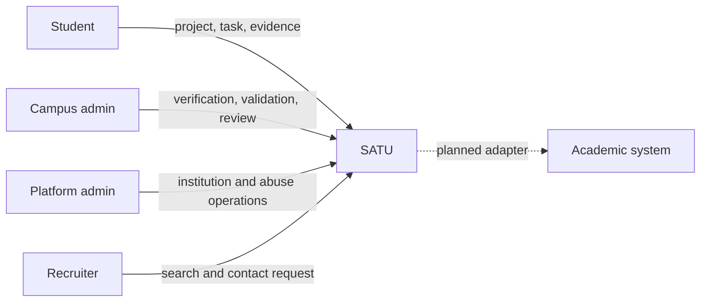
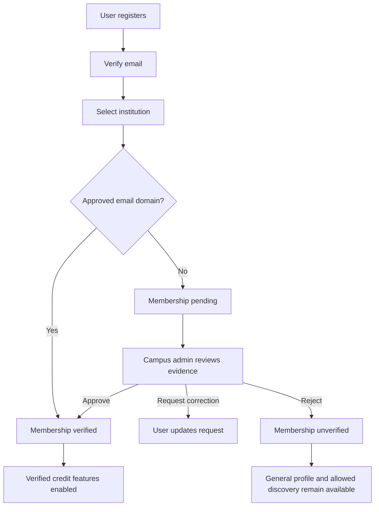
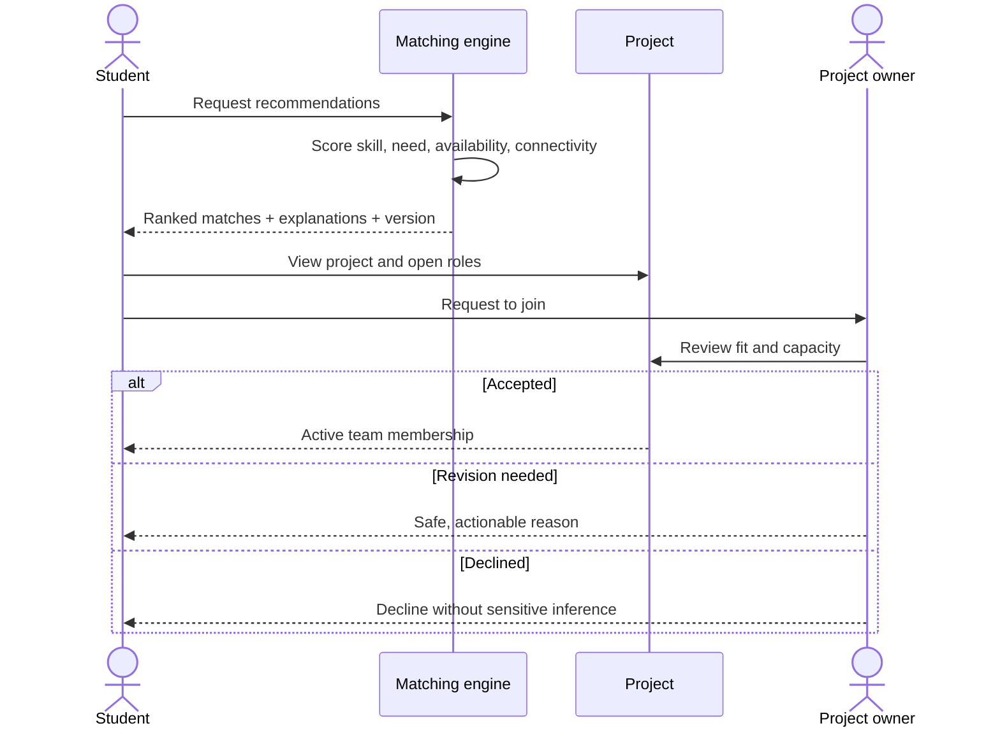
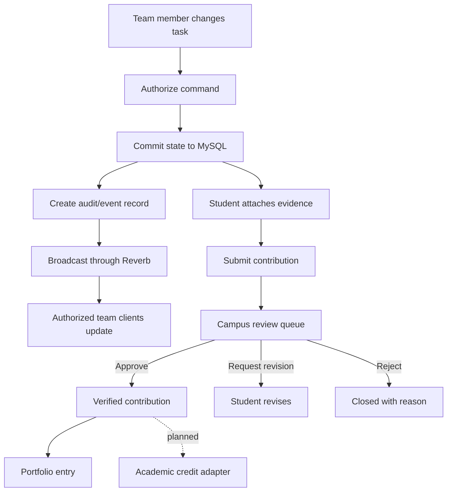
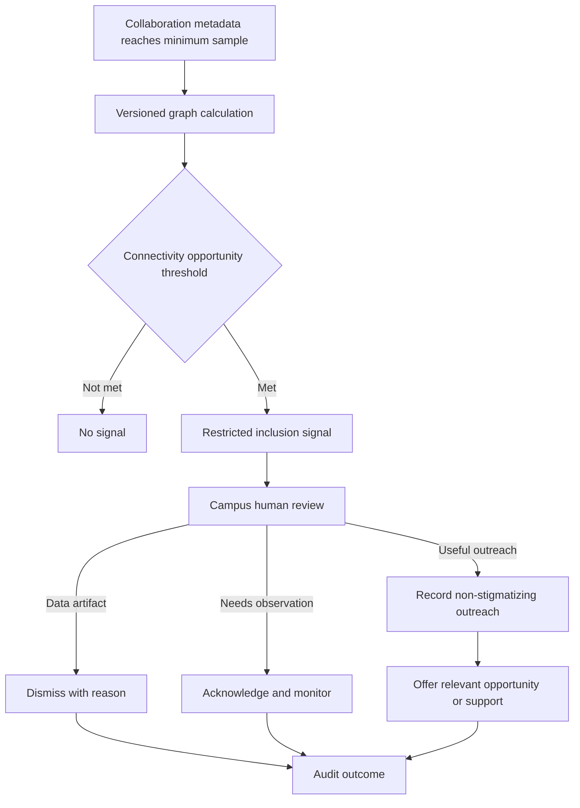
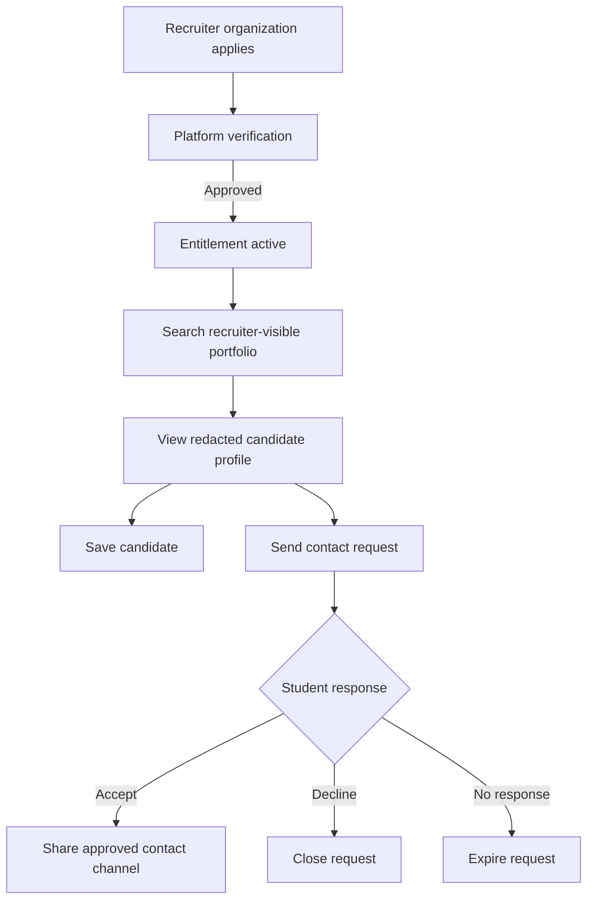
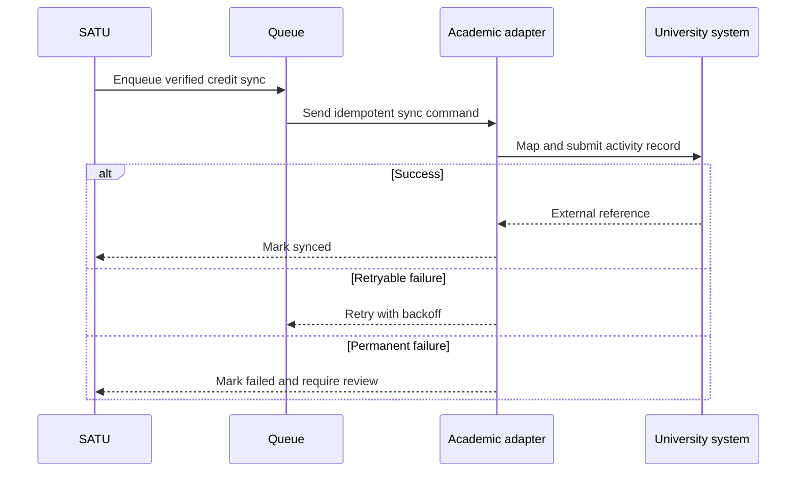

# Business Flow SATU

## 1. Actor Map

## 2. Open Registration dan Campus Verification

## 3. Project Discovery dan Team Formation

## 4. Realtime Workspace dan Contribution

## 5. Inclusion Review

Inclusion flow tidak memberi diagnosis, tidak mengirim label risiko kepada student, dan tidak tersedia bagi recruiter.

## 6. Recruiter Flow: Fase Lanjutan

## 7. Academic Integration: Fase Lanjutan

## 8. Business Control Points

- Campus verification mengontrol klaim afiliasi.
- Validation policy mengontrol verified contribution.
- Consent dan visibility mengontrol recruiter exposure.
- Human review mengontrol inclusion action.
- Entitlement mengontrol Talent Portal.
- Idempotency mengontrol academic sync.
- Audit log menghubungkan setiap keputusan sensitif dengan aktor dan alasan.
