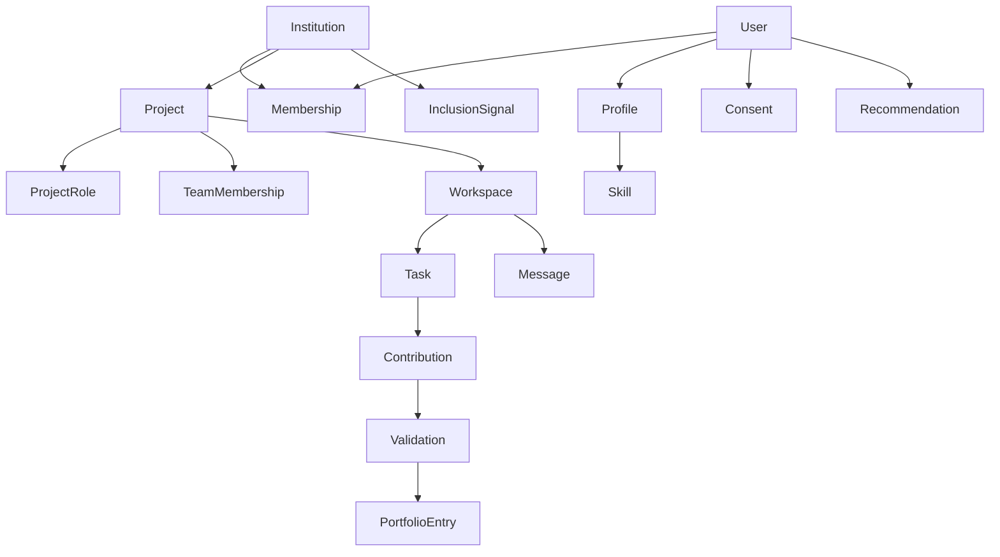

# Information Architecture SATU

## 1. Domain Object Hierarchy

Navigation mengikuti object dan task, bukan struktur database.

## 2. Student Navigation

### Primary

1. **Dashboard**: next action dan status penting.
2. **Projects**: discovery, recommendation, dan project yang diikuti.
3. **Workspace**: active project work.
4. **Contributions**: submission, revision, dan validation.
5. **Portfolio**: evidence yang dipilih dan visibility.

### Secondary

- Notifications
- Profile & skills
- Privacy & consent
- Account & security

Mobile memakai top app bar dan navigation drawer selama aplikasi baru memiliki
satu primary destination yang benar-benar tersedia. Bottom navigation baru
ditambahkan setelah sedikitnya dua primary destinations memiliki named route,
authorization, dan layar yang dapat digunakan. Navigation tidak boleh memuat
placeholder disabled atau dead link. Destination lain masuk ke menu account,
bukan dijejalkan ke bottom bar.

## 3. Campus Navigation

1. **Campus overview**
2. **Membership verification**
3. **Project oversight**
4. **Contribution validation**
5. **Inclusion review**
6. **Reports**
7. **Institution settings**

Campus navigation hanya muncul bagi authorized membership. Switching institution, bila kelak tersedia, harus mengubah context secara eksplisit dan mengosongkan cached tenant data.

## 4. Recruiter Navigation: Fase Lanjutan

1. Talent search
2. Saved candidates
3. Contact requests
4. Organization members
5. Subscription

Recruiter tidak memiliki navigation path menuju campus operations atau inclusion review.

## 5. Conceptual Route Map

| Route                           | Role         | Purpose                              | Stage             |
| ------------------------------- | ------------ | ------------------------------------ | ----------------- |
| `/`                             | Public       | Product landing                      | Later             |
| `/onboarding`                   | Student      | Affiliation, profile, skill, consent | Increment 1       |
| `/dashboard`                    | Student      | Next action dan active work          | Increment 1       |
| `/projects`                     | Student      | Discovery dan recommendation         | Increment 1       |
| `/projects/create`              | Student      | Create project                       | Increment 1       |
| `/projects/{project}`           | Student      | Project detail dan team formation    | Increment 1       |
| `/projects/{project}/workspace` | Team         | Realtime collaboration               | Increment 1       |
| `/contributions`                | Student      | Submission dan validation status     | Increment 1       |
| `/portfolio`                    | Student      | Portfolio management                 | Increment 1       |
| `/campus`                       | Campus admin | Operational overview                 | Increment 1       |
| `/campus/memberships`           | Campus admin | Membership queue                     | Increment 1       |
| `/campus/validations`           | Campus admin | Contribution review                  | Increment 1       |
| `/campus/inclusion`             | Campus admin | Restricted human review              | Increment 1 gated |
| `/campus/reports`               | Campus admin | Participation reporting              | Pilot hardening   |
| `/talent`                       | Recruiter    | Talent search                        | Later             |
| `/talent/candidates/{user}`     | Recruiter    | Redacted portfolio                   | Later             |

Route final harus dibuat sebagai named Laravel routes dan dikonsumsi melalui Wayfinder.

## 6. Page Composition Rules

### Dashboard

- Bukan sitemap.
- Menampilkan primary next action, active work, deadline, dan status yang memerlukan perhatian.
- Tidak menduplikasi seluruh module.

### Index

- Menyediakan search/filter/sort yang mempertahankan URL query.
- Empty state membedakan “belum ada data” dari “filter tidak menemukan hasil”.
- Data besar memakai pagination atau incremental loading.

### Detail

- Header memuat identity, status, ownership, dan allowed actions.
- Tab hanya digunakan untuk sub-context stabil; jangan menyembunyikan primary action.
- Audit/provenance berada dekat evidence yang dijelaskan.

### Queue

- Menampilkan reason for priority, age, owner, dan next action.
- Bulk action hanya untuk keputusan yang aman dan reversibel.
- Selection state bertahan secara eksplisit, tidak tersirat.

## 7. Responsive Information Priority

Pada layar sempit:

1. Object identity dan status.
2. Primary action.
3. Blocking information.
4. Current work.
5. Supporting evidence.
6. History dan secondary metrics.

Context rail berubah menjadi drawer atau disclosure setelah primary content, bukan diletakkan sebelum task.

## 8. Permission-Aware Navigation

- Navigation item disembunyikan bila role tidak pernah dapat mengaksesnya.
- Jika akses hilang saat pengguna berada di halaman, tampilkan forbidden state dengan recovery action.
- Backend policy tetap menjadi authority; hidden navigation bukan authorization.
- Deep link lintas tenant tidak boleh mengungkap apakah object ada.
