# UI/UX Playbook SATU

## Tujuan

Folder ini mengatur bagaimana pengalaman SATU dibentuk sebelum kode UI ditulis. PRD menjelaskan apa yang harus tersedia; UX docs menjelaskan bagaimana pengguna memahami dan mengoperasikannya; `DESIGN.md` mengatur dunia visual; Impeccable surface brief mengatur satu route atau flow secara spesifik.

## Urutan Baca untuk UI Work

1. [`PRODUCT.md`](../../PRODUCT.md)
2. [`PRD.md`](../product/PRD.md)
3. [`DESIGN.md`](../../DESIGN.md)
4. [`UX_STRATEGY.md`](UX_STRATEGY.md)
5. [`INFORMATION_ARCHITECTURE.md`](INFORMATION_ARCHITECTURE.md)
6. [`SCREEN_INVENTORY.md`](SCREEN_INVENTORY.md)
7. Matching file di [`.impeccable/surfaces/`](../../.impeccable/surfaces/)
8. [`CONTENT_ACCESSIBILITY.md`](CONTENT_ACCESSIBILITY.md)

Jika sebuah surface belum memiliki brief, jangan langsung mengimplementasikannya. Jalankan:

```text
$impeccable shape <surface>
```

Shape brief harus mengunci job, outcome, hierarchy, states, interaction, responsive behavior, dan boundaries sebelum build.

## Impeccable Lifecycle

```mermaid
flowchart LR
    Product[PRODUCT + PRD] --> Shape[impeccable shape]
    Shape --> Brief[Surface brief]
    Brief --> Design[DESIGN seed/world]
    Design --> Build[Implement surface]
    Build --> Document[impeccable document]
    Document --> Audit[impeccable audit]
    Audit --> Harden[impeccable harden]
    Harden --> Polish[impeccable polish]
```



- `shape` merancang surface tanpa kode.
- `DESIGN.md` mengatur visual world lintas surface.
- `document` dijalankan setelah surface pertama memiliki token dan komponen nyata.
- `audit` memeriksa accessibility, responsiveness, dan technical quality.
- `harden` menangani edge cases, errors, permissions, dan production states.
- `polish` menjadi finishing pass, bukan pengganti requirement.

## Visitor Modes

| Surface                              | Mode       | Success                                        |
| ------------------------------------ | ---------- | ---------------------------------------------- |
| Student/campus/recruiter application | Operate    | Pengguna menyelesaikan task dengan aman        |
| Public portfolio                     | Experience | Artifact dan contribution memimpin             |
| Marketing landing page               | Persuade   | Pengunjung memahami mekanisme dan bertindak    |
| Help/documentation                   | Read       | Pengguna menemukan jawaban dan kembali bekerja |

Mode ditentukan per surface, bukan per product. Semua application surface tetap mewarisi `DESIGN.md`.

## Definition of Ready: UI

Sebuah surface siap dibangun jika:

- Role dan permission diketahui.
- Primary job dan success outcome diketahui.
- Minimum, typical, dan maximum content range tersedia.
- Empty, loading, error, success, stale, reconnect, dan forbidden states yang relevan sudah ditentukan.
- Route atau target file sudah dipetakan.
- Surface brief tersedia.
- Data yang synthetic ditandai.
- Accessibility acceptance criteria tersedia.

## Definition of Done: UI

- Behavior sesuai surface brief.
- Visual sesuai `DESIGN.md`.
- Mobile dan desktop diperiksa.
- Keyboard, focus, screen-reader name, contrast, status text, dan reduced motion diperiksa.
- Tidak ada hardcoded backend URL; gunakan Wayfinder.
- Form memiliki processing, validation, success, dan failure feedback.
- Realtime state dapat pulih melalui server refresh.
- Browser test critical flow dan no-console-error check tersedia.
- Impeccable audit, harden, dan polish telah dilakukan sesuai risiko.

## Asset Gambar

Jika sebuah surface membutuhkan asset bitmap dan belum ada asset yang disetujui,
AI agent boleh membuat gambar sendiri dengan kemampuan image generation yang
tersedia. Pilih asset yang mendukung tujuan interface, periksa hasilnya secara
visual, dan simpan hanya asset yang benar-benar dipakai oleh produk. Jangan
menghasilkan gambar bila SVG, icon system, CSS, atau asset yang sudah tersedia
lebih tepat.

## Ownership

- Product truth: `PRODUCT.md` dan PRD.
- Global visual world: `DESIGN.md`.
- Route-specific strategy: matching surface brief.
- Cross-surface UX: dokumen dalam folder ini.
- Runtime contract: technical documentation dan code.

Jangan menyalin token global ke surface brief atau menyalin seluruh PRD ke UX docs.
