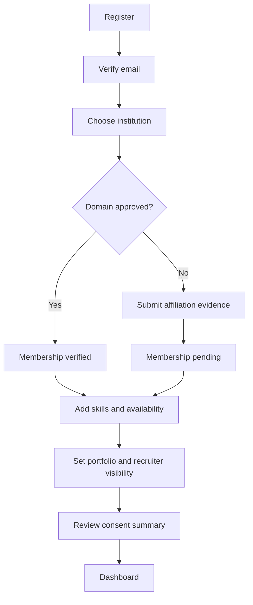
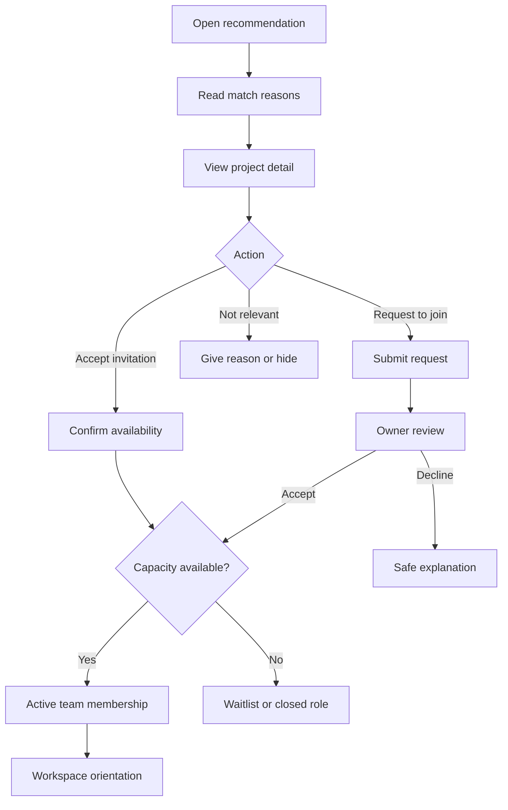
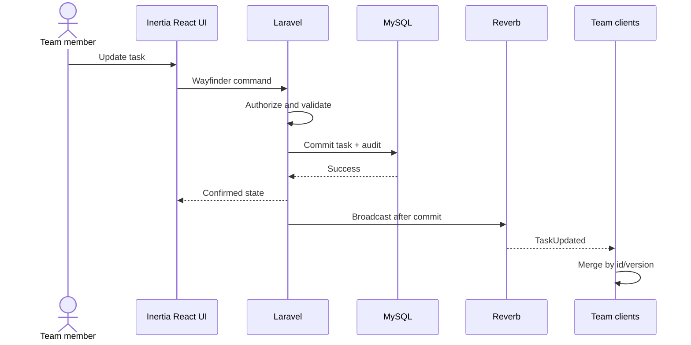
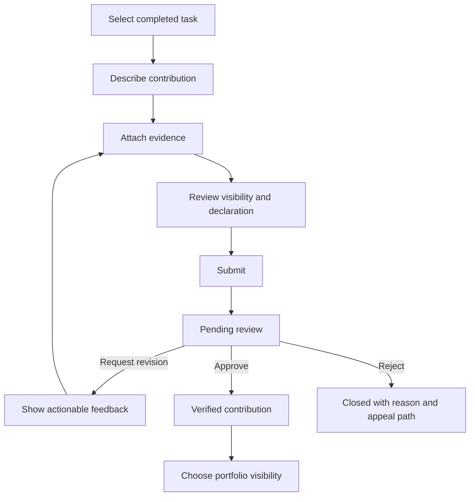
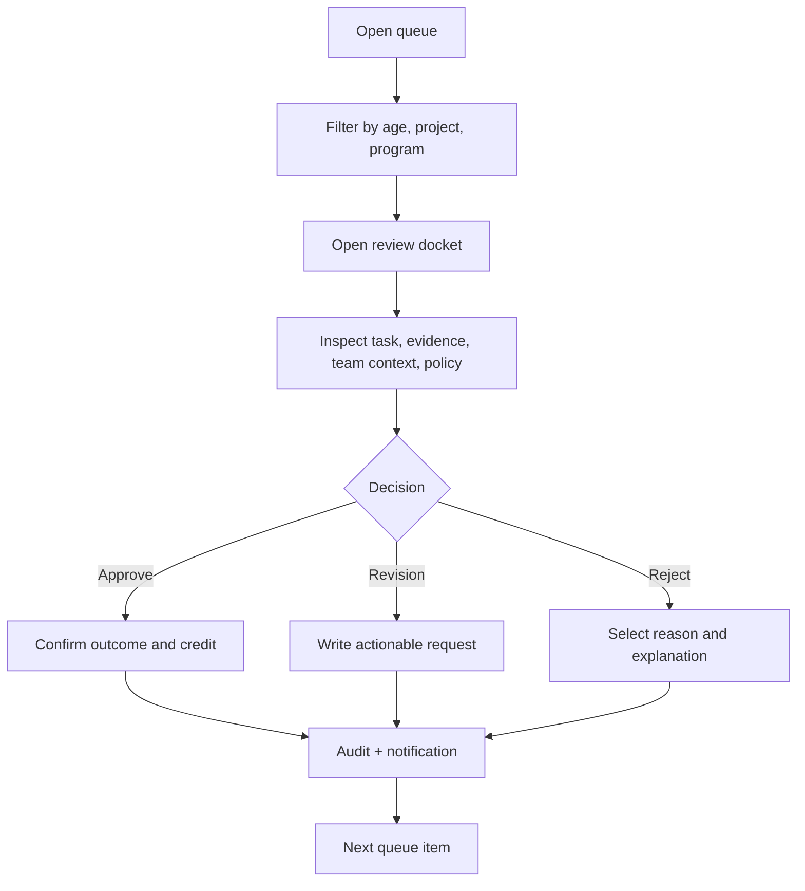
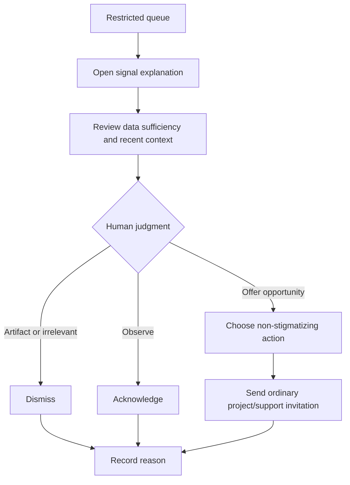
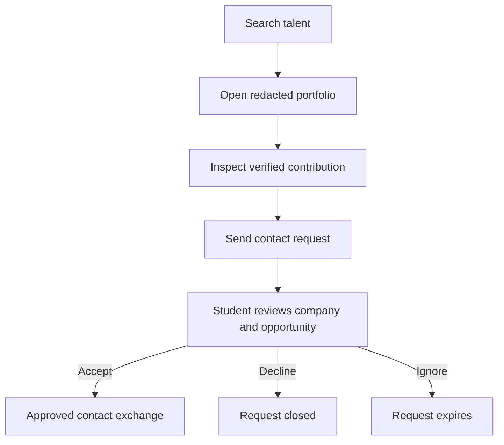
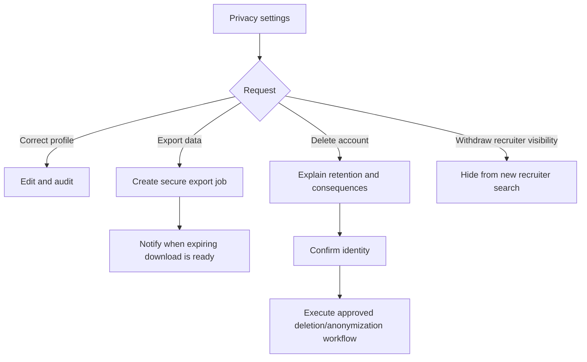

# User Flows SATU

## 1. Student Activation

### Recovery

- Duplicate email mengarah ke login/reset password.
- Invalid domain tidak menyebut daftar internal domain secara berlebihan.
- Pending membership menjelaskan apa yang tetap dapat dilakukan.
- User dapat menyimpan onboarding progress.

## 2. Recommendation to Active Team

### Guardrails

- Tidak ada alasan yang menyebut student diprioritaskan karena “rentan”.
- Action menunjukkan commitment dan deadline.
- Capacity transition dilakukan atomic.

## 3. Realtime Task Flow

### Failure paths

- Validation error mempertahankan input.
- Authorization loss mengembalikan object ke server state.
- Reverb disconnect menampilkan connection state tanpa memblokir local reading.
- Reconnect memicu state reconciliation.
- Duplicate event diabaikan berdasarkan event/object version.

## 4. Contribution Validation

## 5. Campus Validation Queue

## 6. Inclusion Review

Student menerima opportunity atau support copy biasa, bukan risk label.

## 7. Recruiter Contact: Later

## 8. Account and Data Rights

